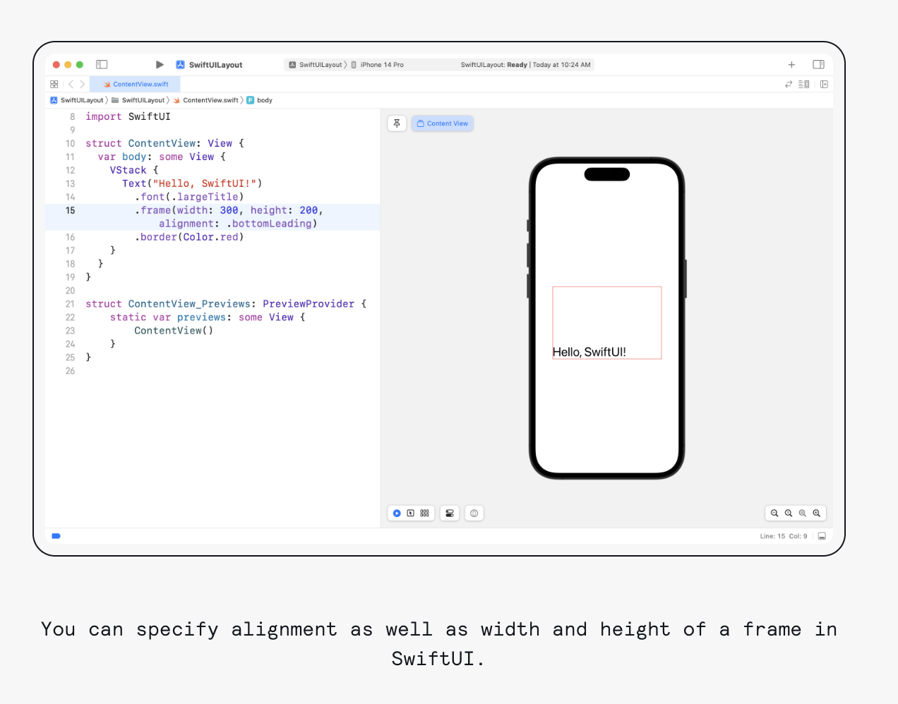

#  Understanding Frames & Alignment in SwiftUI

**Adjusting the size or position of a view in SwiftUI can sometimes behave unpredictably if you don’t fully understand frames and alignment. Grasping these concepts is crucial for controlling the layout of your views effectively.**

**A frame in SwiftUI is a rectangular area that describes the position and size of a view, comparable to a box enclosing the view’s content. The frame’s position is influenced by the view’s location within its parent view, and its size is defined by the view’s intrinsic content size or by the modifiers applied to it.**

Let’s look at an example:

```swift
struct ContentView: View {
  var body: some View {
    VStack {
      Text("Hello, SwiftUI!")
        .font(.largeTitle)
        .frame(width: 300, height: 200, alignment: .bottomLeading)
        .border(Color.red)
    }
  }
}
```
Your preview should look like this:



In this example, you create a VStack that contains a Text view. You then utilize the frame modifier on the Text view, setting its width and height to 300 and 200, respectively.

The alignment parameter to the frame modifier specifies .bottomLeading. This positions the text at the bottom left corner of the frame. You then further visualize the frame by adding a red border around it.

By default, SwiftUI views are centered within their frames. In this case, you override the default behavior to demonstrate how you can control a view’s alignment within its frame.

By mastering the use of frames and alignment, you can create SwiftUI layouts with increased precision and aesthetic appeal. You’ll find it much simpler to position and size your views exactly as desired.


----


For Image:
- .resizable() allows the Image view to dynamically adjust its size based on the available space. It ensures that the image can be scaled up or down without losing its aspect ratio.

- .aspectRatio(contentMode: .fit) sets the aspect ratio of the image. In this case, the .fit content mode is used, which scales the image to fit within the available space while maintaining its aspect ratio. This ensures that the entire image is visible without distortion.

- .frame(maxWidth: .infinity, maxHeight: .infinity) sets the maximum width and height of the Image view to occupy the maximum available space within its parent view or container. The value .infinity means that the frame can expand as much as possible. This helps the image take up as much space as it can without exceeding the parent view’s boundaries.

- .padding() adds padding around the Image view. Calling padding without parameters applies the default padding. This helps create some spacing between the image and the surrounding views or layout elements.
 
 
 
