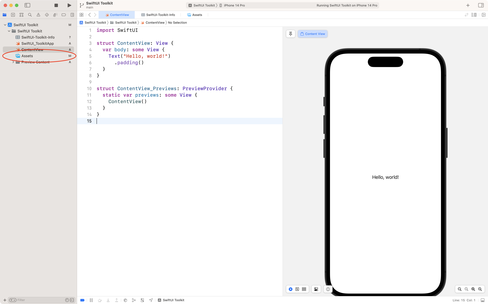
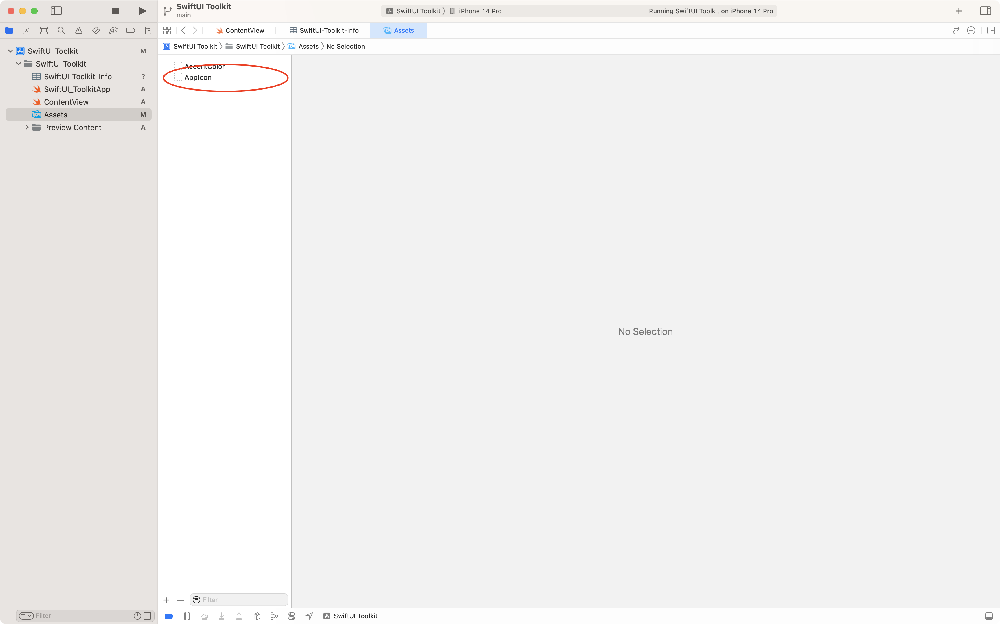
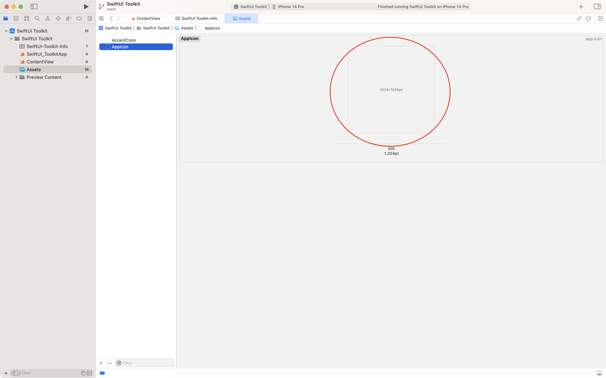
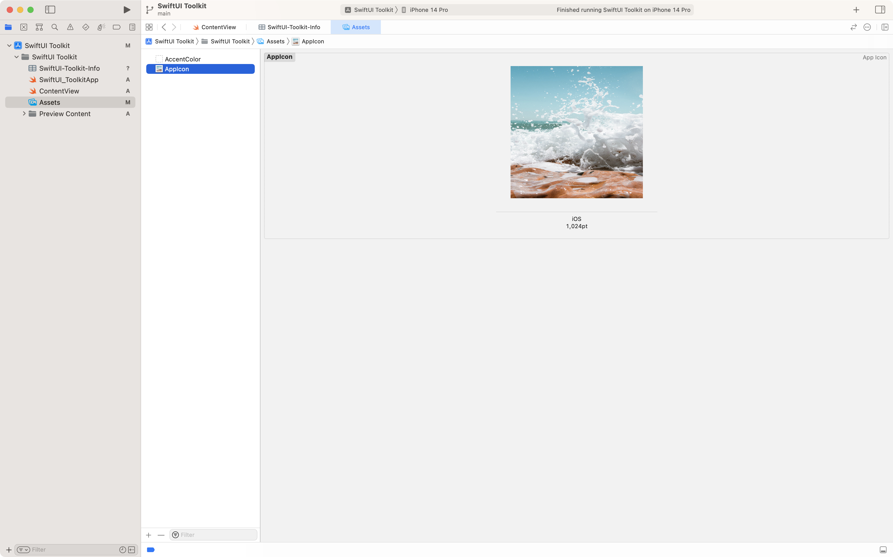

#  Configuring App Icons & Launch Screens in SwiftUI

As developers, one of the things we strive for is to create an app that not only works well but also looks good. One of the ways we can achieve this is by customizing our app’s icon and launch screen. In this cookbook entry, you’ll learn how to do just that in your SwiftUI app.

## Adding an Icon to a SwiftUI App

When you create a SwiftUI project, Xcode automatically includes a default asset catalog named Assets.xcassets that contains the AppIcon set. If you wish to change the app icon, follow these steps:

1. In the Project navigator, select Assets.

